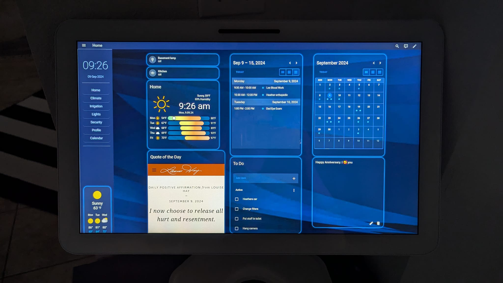
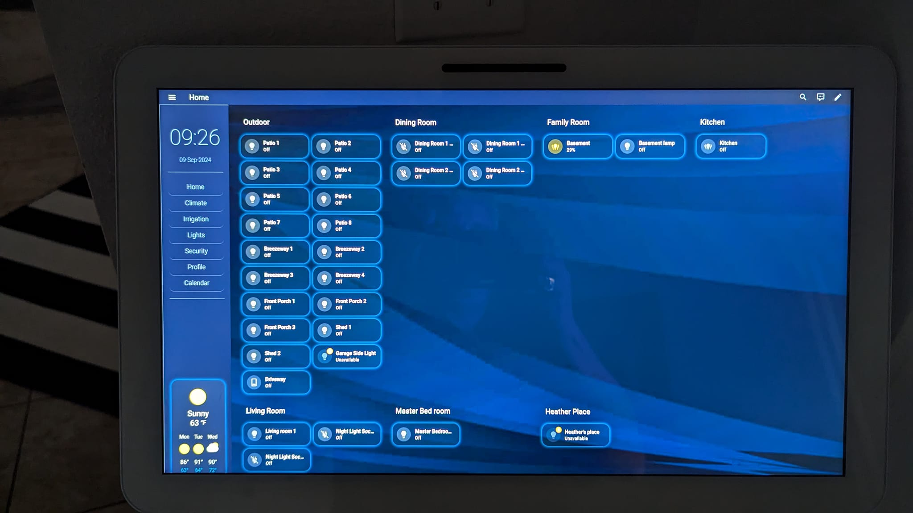

# Biofects
Biofects theme is: A modern HUD display for Home Assistant.  **[WIP]**

# About this theme and why I made it
I made this theme to give a easy on the eyes look and simple to use for my family. This theme for my layout is also using many additional plugins to give me a look and feel that we found to be easy to navigate

1. My Home assistnat runs on a server in Docker. No I do not used supervised, no I do not send data to Home Assistant. This is my choice to struggle a bit more than a managed OS but I am ok with that. 

<strong style="color:red;">I dont know how it works with HAOS</stong>

2. I also try to secure any **phone home** calls from IOT devices on my network. 
3. I have many IOT devices I have are need to add to my Home Assistant
    - Hue
    - Tuya 
    - Different Appliances
    - Grafana to monitor everything
    - Emby
    - Fans
    - Local AI running on server
    - Pi Hole to block ads
    - All my network gear, server, GPU, Filers monitoring, security
    - Door Locks
    - Cameras
This is just examples of what is in my Home Assistant. With plans to add more.

### Donatiosn Welcome and Apprciated

## Plugins I use to give me the get the layout I wanted ##
- [Sidebar Card](https://github.com/DBuit/sidebar-card) Create an easy to use navigation
- [Wall Panel](https://github.com/j-a-n/lovelace-wallpanel) Great screen saver
- [Card Mod](https://github.com/thomasloven/lovelace-card-mod) adding style to cards
- [Restriction Card](https://github.com/iantrich/restriction-card) Locking out the thermostats :) 
- [Unifi Gateway](https://github.com/custom-components/sensor.unifigateway)
- [Unifi Counter Sensors](https://github.com/clyra/unifics)
- [Simple Sticky Note](https://github.com/biofects/simple_sticky_note)
- [Clock Weather Card](https://github.com/pkissling/clock-weather-card)

## Installing the theme ##
### HACS (Recommended)

#### Adding as a Custom Repository

1. Make sure you have [HACS](https://hacs.xyz/) installed in your Home Assistant instance.
2. Go to the HACS panel, then click on the three dots in the top right corner and select "Custom repositories."
3. In the dialog that appears, paste the following URL: [https://github.com/biofects/biofects-theme](https://github.com/biofects/Biofects-theme) and select "Theme" as the category.
4. Click "Add," then navigate to the "Theme" tab, click the "+ Explore & Download Repositories" button, and search for "Biofects"
5. Install the theme and restart Home Assistant.
6. Go to User profile and change the theme to Biofects

Support
For bugs or feature requests, please open an issue on the GitHub repository.

License
This project is licensed under the MIT License.

## How I made my layout using my theme and additional plugins

### Please see my plugin list above

1. I updated each dashboard to support Wall Panel and Sidebar-card
2. All the content of the YAML should be placed above the views in the dashboard. (I know I could make a template -- Maybe Later
[lovelace-dashboard.yaml](./examples/lovelace-dassboard.yaml)

3. I create an Sample box example
[Clock-Weather_card-configuration.yaml](./examples/Clock-Weather_card-configuration.yaml)

